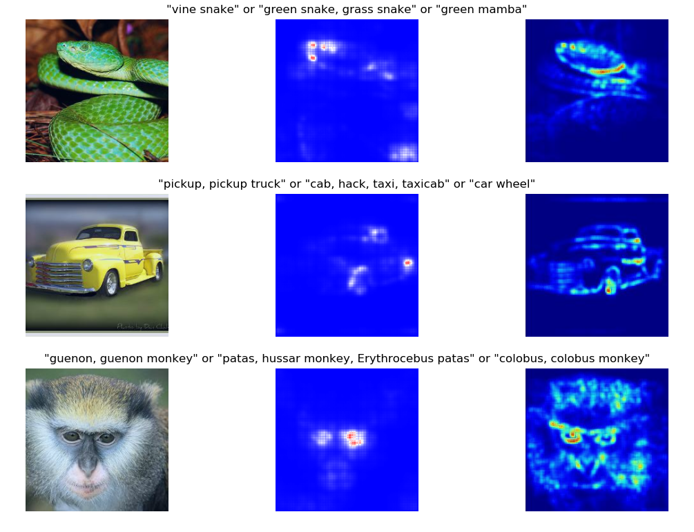

Visual Back Propagation
=======================

Reproduction of NVidia paper:  
[VisualBackProp: efficient visualization of CNNs](https://arxiv.org/pdf/1611.05418.pdf)  

**Right Column**: Visualization masks produced from the NVIDIA paper 
(figure 1 from the paper). These were obtained from ResNet-200 trained on ImageNet.

**Center Column**: Reproduced visualization masks using ResNet-50 trained on ImageNet
(from torchvision).*
